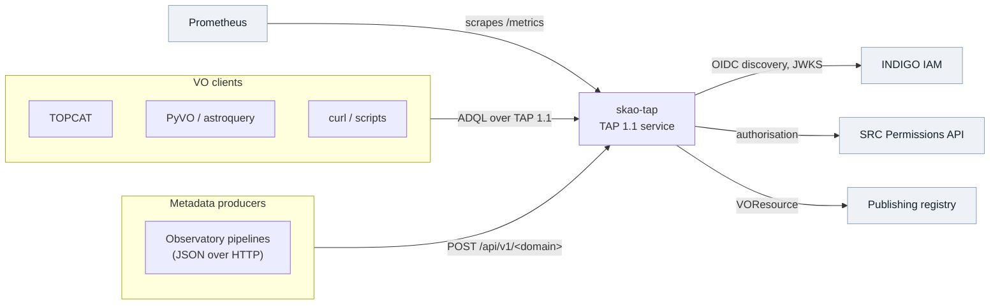
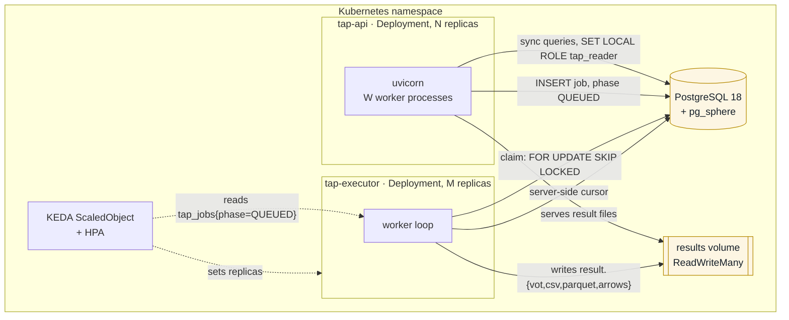
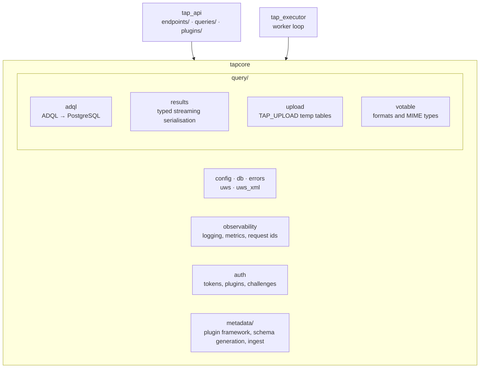
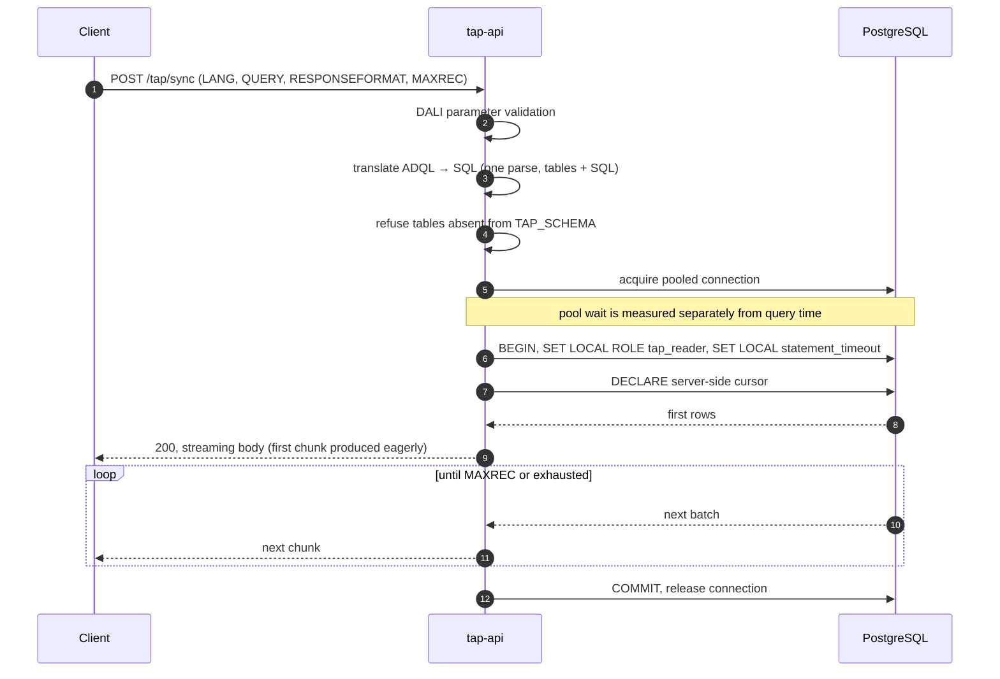
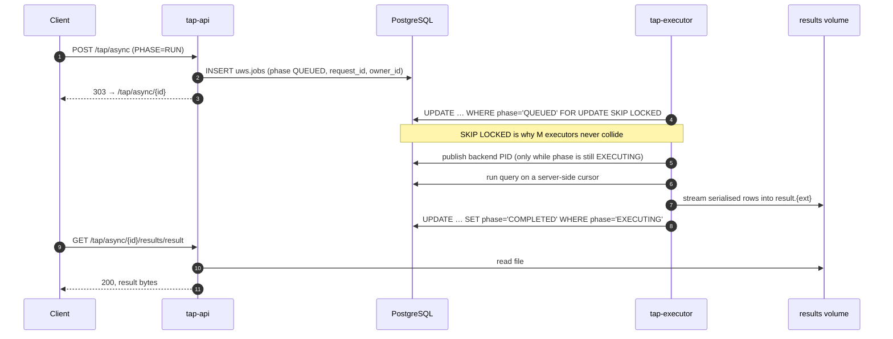
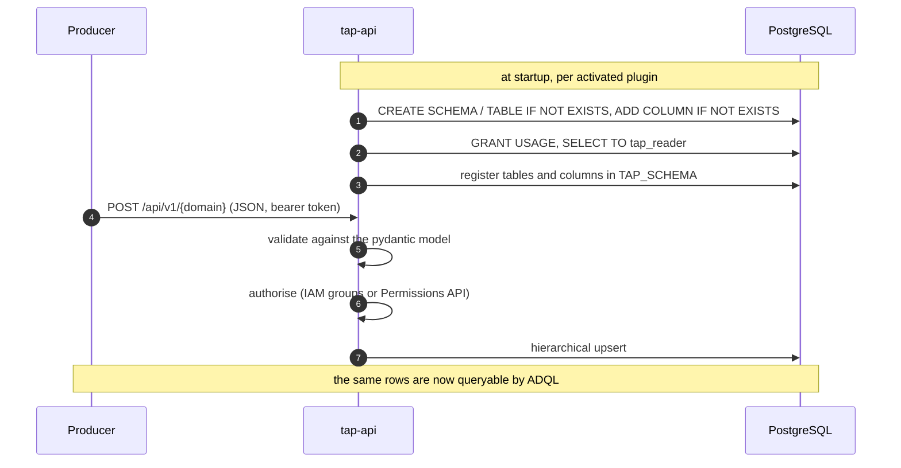
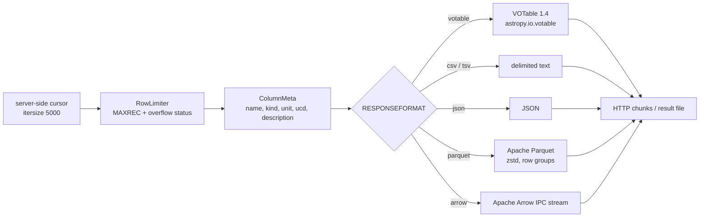
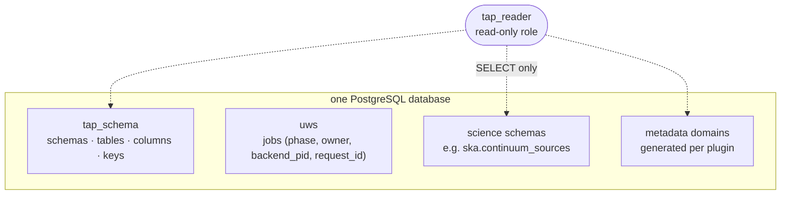
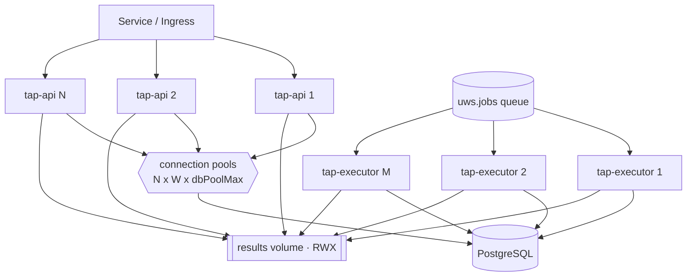
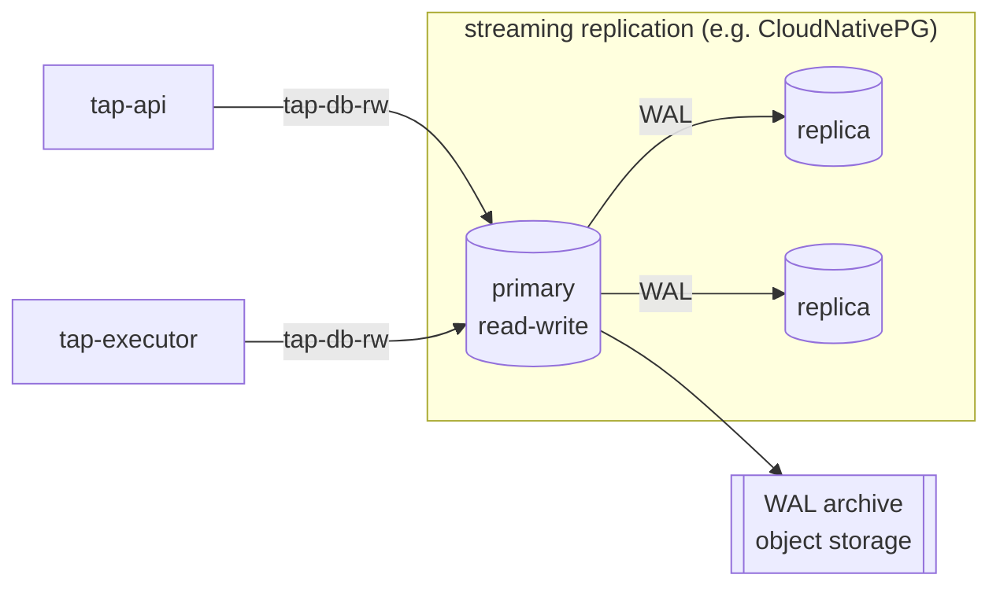

# Architecture

Two stateless services over one PostgreSQL database and one shared volume.
That is the whole shape, and most of the design follows from a single decision:
**PostgreSQL is the only coordination point.** There is no message broker, no
cache tier and no service registry, because the job queue, the metadata, the
science tables and the schema description all live in the same database that
has to be transactional anyway.

## Context



Authentication and authorisation are external and pluggable: tokens are
verified against the IAM's JWKS, and authorisation decisions come either from
IAM group membership or from the SRCNet Permissions API. See
[Authentication](auth.md).

## Components



| Component | Code | Responsibility |
| --- | --- | --- |
| `tap-api` | `services/tap-api` | Every TAP/UWS/VOSI HTTP endpoint; runs synchronous queries itself; creates and serves UWS jobs; the metadata-domain JSON API |
| `tap-executor` | `services/tap-executor` | Claims and runs asynchronous jobs; writes result files; expires old jobs; publishes queue metrics |
| `db` | `db/` | PostgreSQL 18 with pg_sphere; `TAP_SCHEMA`, `uws.jobs`, science tables and the read-only `tap_reader` role |
| `tapcore` | `libs/tapcore` | Everything both services need |

Neither service holds state that survives its process. An API replica can be
killed mid-request and a client retries; an executor can be killed mid-job and
another claims it once the row is visible again. What must survive is in
PostgreSQL or on the volume.

### Shared code



The split is by role rather than by layer: `query/` is everything between an
ADQL string and bytes on the wire, `metadata/` is everything between a pydantic
model and a queryable SQL schema, and the flat core is what both need.

## Request paths

### Synchronous query



Two details are load-bearing. The **first chunk is produced eagerly**, so a
translation or permission error becomes a clean 4xx instead of a truncated
200 body. And the connection stays checked out for the whole download, which
is why a client on a slow link occupies a database connection — the reason
`tap_db_pool_wait_seconds` measures only the acquisition and not the hold (see
[Observability](observability.md)).

If no connection comes free within `config.dbPoolTimeoutSeconds`, the request
is refused with `503` and `Retry-After` rather than held.

### Asynchronous job (UWS)



The two conditional updates are the concurrency design. The PID is published
only while the phase is still `EXECUTING`, so an `ABORT` that already landed is
honoured instead of being overwritten with a stale PID; and the transition to
`COMPLETED` is conditional on the same phase, so an abort committed at any
moment during the run wins. When it does win, the executor discards the result
file and still records the outcome — an aborted job is an outcome, not a gap.

`ABORT` cancels the running statement through `pg_cancel_backend()` on that
published PID, so a runaway query stops in the database rather than being
abandoned by the client.

### Metadata ingest



The bootstrap re-runs on every API start, which is what keeps the grants and
the `TAP_SCHEMA` registration correct after a model gains fields. A schema
added by hand outside this path has to do the same three things itself —
notably the `GRANT`, without which every query against it fails with
*permission denied for schema*.

## The result pipeline

One typed pipeline serves every format, and the type information comes from
`TAP_SCHEMA` joined to the cursor description — so units, UCDs and
descriptions follow the data into whichever container the client asked for.



Everything streams. Rows arrive from a server-side cursor in batches of 5,000
and leave as HTTP chunks, so a ten-million-row result never exists in memory in
either service.

### Apache Arrow and Parquet

Both are first-class result formats, not exports bolted on afterwards:

| | `RESPONSEFORMAT` | Media type | On the wire |
| --- | --- | --- | --- |
| Parquet | `parquet` | `application/vnd.apache.parquet` | zstd-compressed row groups, written incrementally |
| Arrow | `arrow` | `application/vnd.apache.arrow.stream` | Arrow IPC stream, record batches of 10,000 rows |

Both share one Arrow schema built from the column metadata, which is where the
value is:

- **VO semantics survive the format change.** `unit`, `ucd` and `description`
  are attached as Arrow *field metadata*, so a Parquet file or an Arrow stream
  carries the same column semantics a VOTable would. A consumer reading the
  Parquet with pandas or DuckDB still has the UCD.
- **Timestamps are ISO-8601 strings**, deliberately, so a value means the same
  thing in Parquet as it does in the CSV and VOTable outputs rather than
  depending on a timezone convention.
- **Overflow is signalled inside the file.** The DALI `QUERY_STATUS` —
  `OK` or `OVERFLOW` when `MAXREC` truncated the result — is written into the
  Parquet key-value metadata, so a truncated Parquet result says so without a
  sidecar.
- **Both are streamed, not buffered.** The writers emit into an append-only
  sink that is drained after every batch, so Parquet row groups and Arrow
  batches go out as they are produced. An empty result still yields a valid
  schema-only Parquet file.

For bulk transfer these are the formats to prefer: a wide ObsCore result is
several times smaller as zstd Parquet than as VOTable XML, and it lands
directly in the dataframe tooling that analysis actually uses. VOTable remains
the default because that is what the standard and the existing VO clients
expect.

## Data plane



Every user query runs as `tap_reader` under `SET LOCAL ROLE`, inside a
transaction with a statement timeout. The services connect as the owning user
and downgrade before touching untrusted SQL, so an ADQL query cannot write,
whatever it manages to express.

`TAP_SCHEMA` is not decoration: a query naming a table that is not published
there is refused before it reaches the database.

## Replication and scale-out

Both services scale horizontally, for different reasons and with different
limits.



**tap-api** is stateless, so replicas need no coordination at all. Within a
pod, `tapApi.workers` adds uvicorn worker *processes* — which is the knob that
matters, because ADQL translation is pure-Python and holds the GIL: one worker
saturates one core no matter how large the pod's CPU limit is. Measured:
59 req/s with one worker against 210 with four, same machine, same queries.

**tap-executor** replicas cooperate through the database. `FOR UPDATE SKIP
LOCKED` means each claim takes a different row without blocking, so M
executors give M concurrent jobs with no broker, no leases and no split-brain.
Each executor runs one query at a time, so M is the async concurrency.

**The results volume must be `ReadWriteMany`** as soon as more than one pod
writes or reads it — the executor writes result files and the API serves them.
With `ReadWriteOnce` everything must land on one node, which is fine for
development and a hard limit in production.

**The connection ceiling is the real scale-out limit**, and it is arithmetic:

```
tapApi.replicas x tapApi.workers x config.dbPoolMax     (API side)
  + tapExecutor.replicas x config.dbPoolMax             (executor side)
  ≤ max_connections - superuser reserve
```

Every replica added multiplies connections against a database that has a fixed
number to give. The chart checks this sum when `postgresql.tuning.max_connections`
tells it the limit, and refuses a configuration that would scale into a
connection wall. Past the point where the arithmetic stops working, the answer
is a connection pooler (pgbouncer in transaction mode) rather than more
replicas, so the ceiling becomes the pooler's rather than the sum of every
pod's.

**Autoscaling** replaces the static counts: the API on CPU, the executors on
queue depth. Both are opt-in and have their own page —
[Autoscaling](autoscaling.md).

**Resilience defaults** are on: soft pod anti-affinity across nodes and a zone
topology-spread constraint, plus a PodDisruptionBudget for any component with
more than one effective replica, so a node drain cannot take the last one.

### PostgreSQL replication

The in-chart StatefulSet is deliberately a single instance: it exists so
`helm install` produces something that works, not so a production site runs
it. For real deployments the database is external and replicated:



Both services take a single DSN, so operator-managed failover is transparent to
them — the service name follows the primary and nothing in the application has
to know. Set it up by disabling the in-chart database and pointing at the
operator's read-write service:

```bash
helm upgrade skao-tap deploy/helm/skao-tap \
  --set postgresql.enabled=false \
  --set externalDatabase.url=postgresql://tap:…@tap-db-rw:5432/tap
```

Load `db/init/*.sql` into the cluster once before the first start. WAL
archiving then gives point-in-time recovery, which the `pg_dump` CronJob
cannot. Full procedure, including restore: [Deployment](deployment.md).

!!! note "Read replicas are not yet used for queries"
    Everything currently goes to the primary. Sending read-only ADQL to
    replicas is a natural fit — user queries are read-only by construction and
    run as `tap_reader` — but the services take one DSN today, so it is a
    change to make deliberately rather than a configuration option. It is on
    the [roadmap](roadmap.md).

## Failure behaviour

| What happens | What the service does |
| --- | --- |
| Every pooled connection busy | `503` with `Retry-After` after `dbPoolTimeoutSeconds`, and `tap_db_pool_exhausted_total` increments |
| Sync query exceeds its budget | statement timeout aborts it in the database; the client gets an error, not a hung socket |
| Client disconnects mid-download | the stream ends, the connection is returned, and the query's duration is still recorded |
| Executor killed mid-job | the row returns to `QUEUED` visibility and another executor claims it |
| `ABORT` during execution | `pg_cancel_backend()` on the published PID; phase becomes `ABORTED` and the partial result is discarded |
| API pod killed | stateless; the client retries, and any job it created is already durable |
| Database restarts | pools reconnect; in-flight requests fail and are retryable, jobs resume from their recorded phase |

## Further reading

- [Deployment](deployment.md) — Helm values, scaling, backup, restore, hardening
- [Autoscaling](autoscaling.md) — what scales on what, and what the chart refuses
- [Observability](observability.md) — the metrics, and following one request end to end
- [Authentication](auth.md) — tokens, gated operations, AuthVO challenges
- [Metadata plugins](plugins.md) — binding a pydantic model to a queryable schema
- [Benchmarking](benchmarking.md) and [Performance](performance/index.md) — how the numbers above were measured
