# Db Scaling — 20260823T231057Z

Run `20260823T231057Z-f0cd5bd7-db-scaling` · commit `a5058118203f` · 2026-08-24 01:43 UTC

!!! success "Validity guards passed"
    No swapping, no OOM kills, no unexpected restarts, disk headroom
    kept, load generator below its own ceiling, monitoring coverage
    complete.

## Headline

| finding | value | evidence |
| --- | --- | --- |
| peak single-replica throughput | **223.1** | sat-D3-c4-r3 at 4 clients, p95 29 ms |
| sustainable single-replica capacity (C1) | **223.1** | highest successful rps with p95 within the 2.0s SLO and errors under 1% |

## What was measured

| dataset | size | ObsCore rows | total rows | index/table | generation |
| --- | --- | --- | --- | --- | --- |
| D3 | 25.28 GiB | 7,399,024 | 106,348,439 | 0.63 | 1,082 s |

Sizes are `pg_database_size()` with indexes — not row counts times an
assumed row width. One database is grown through every target, so each
tier is a genuine prefix of the next.

## Throughput and latency against concurrency

| dataset | clients | reps | requests/s | p95 (ms) | errors | bottleneck |
| --- | --- | --- | --- | --- | --- | --- |
| D3 | 1 | 3 | 128.7 ± 33.6 | 15 | 0.00% | `DATABASE_IO_BOUND` |
| D3 | 2 | 3 | 198.2 ± 24.9 | 17 | 0.00% | `DATABASE_IO_BOUND` |
| D3 | 4 | 8 | 213.5 ± 8.8 | 30 | 0.00% | `TAP_CPU_BOUND` |

Intervals are 95% Student-t across repetitions. The sweep stops when two
saturation signals agree, so the last row of a dataset is where that
dataset's ceiling was found rather than where the ladder ran out.

## Where the limit was

| classification | measurements | meaning |
| --- | --- | --- |
| `DATABASE_IO_BOUND` | 15 | The working set does not fit in shared_buffers plus page cache: the database is fetching from disk. This is the class that appears as the dataset grows and is the reason the size sweep exists. |
| `TAP_CPU_BOUND` | 10 | The API's own CPU is the constraint: it sat at its ceiling, or was CFS-throttled, for a material part of the window. The ceiling compared against is min(pod CPU limit, workers), not the pod limit: ADQL translation is pure-Python and holds the GIL, so one worker cannot exceed one core whatever the cgroup allows. Relieved by more processes (tapApi.workers) or more pods, never by a bigger limit on one worker. |
| `SERIALIZATION_BOUND` | 1 | Large responses with a busy API and an idle database: the time is going into formatting and streaming rows, not into finding them. This is a result-pipeline cost, not a query cost. |
| `UNKNOWN` | 1 | Nothing saturated by these rules. Either the offered load was below every ceiling, or the limit is somewhere this suite does not instrument — which is itself worth knowing. |

## Query plans

| flag | plans | why it matters |
| --- | --- | --- |
| `bad_cardinality_estimate` | 12 | The planner's row estimate was an order of magnitude out, which is how good indexes get ignored. |
| `large_rows_removed_by_filter` | 1 | The plan fetched rows only to throw them away - work done for nothing, and usually a missing or wrong-ordered index. |

## Graphs

### Throughput against offered concurrency

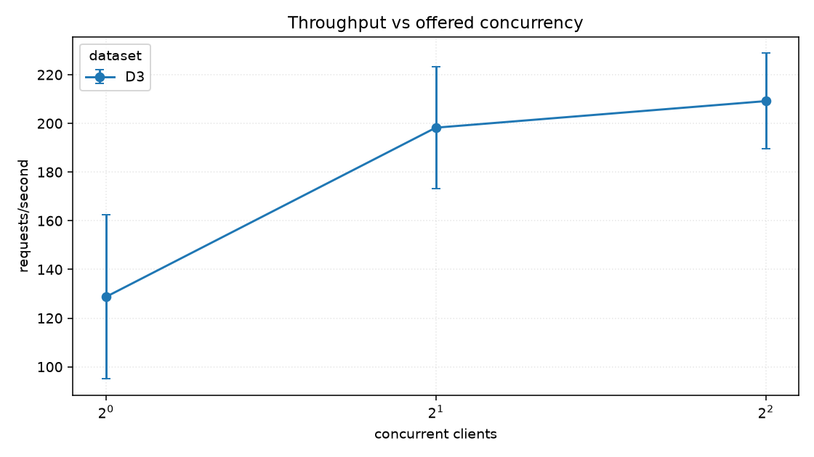

### Latency percentiles against concurrency

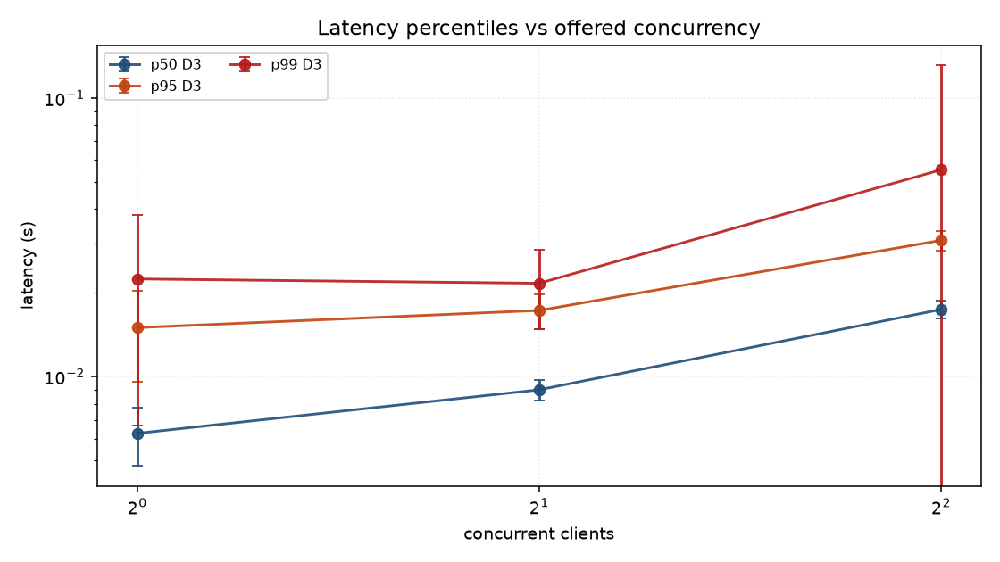

### Errors against concurrency

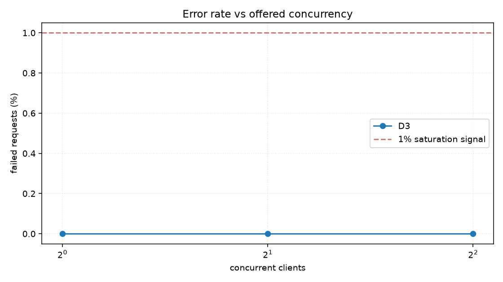

### Buffer cache hit ratio against database size

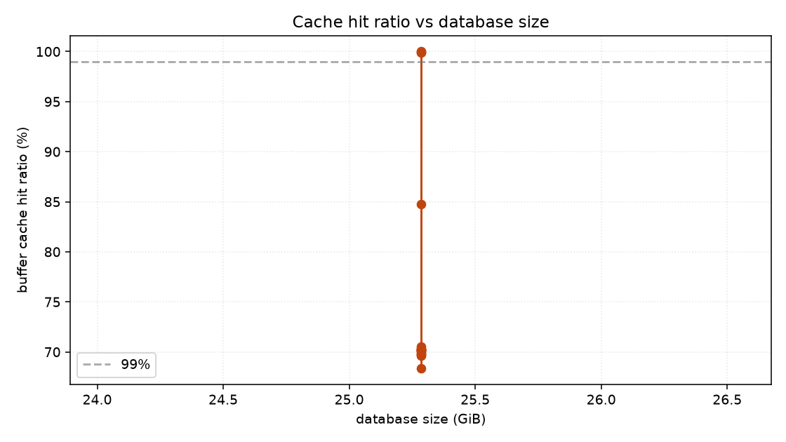

### API CPU against throughput

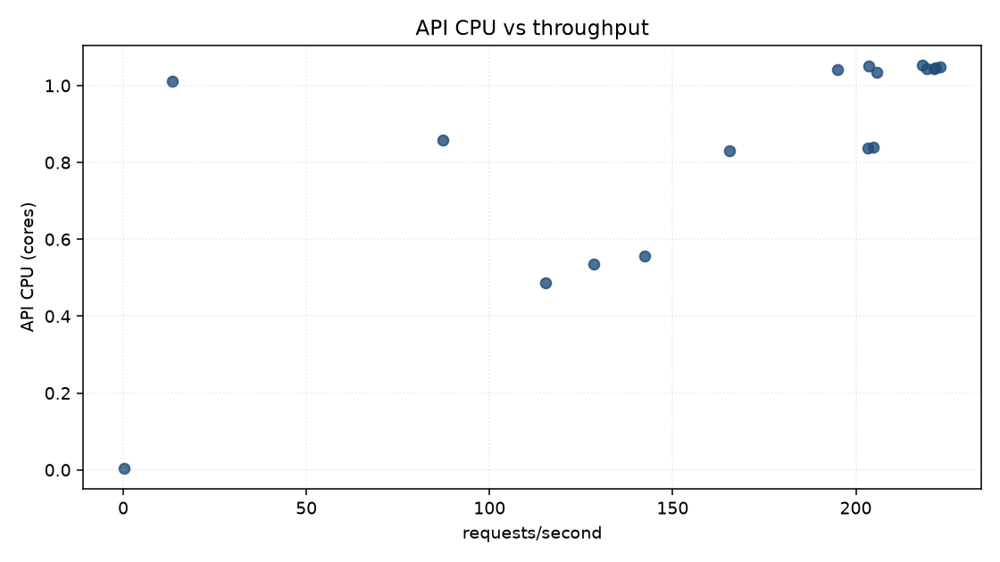

### PostgreSQL CPU against throughput

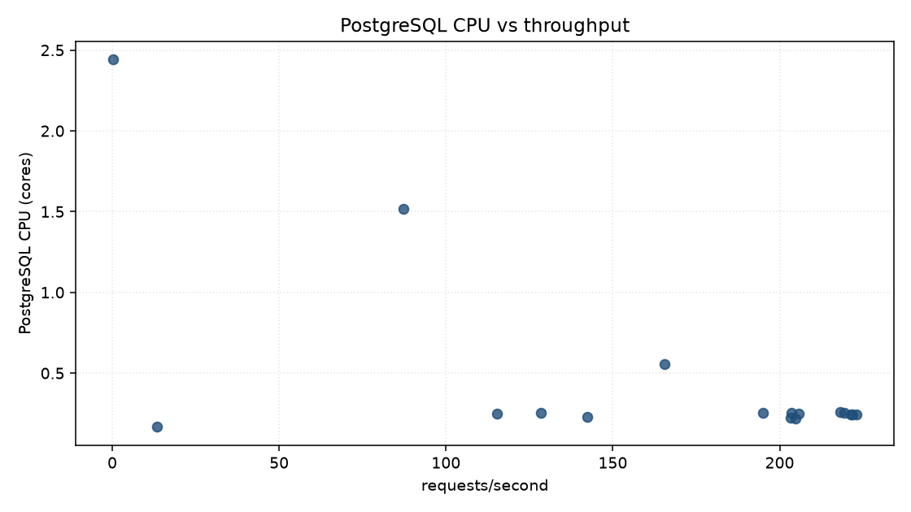

### PostgreSQL read I/O against throughput

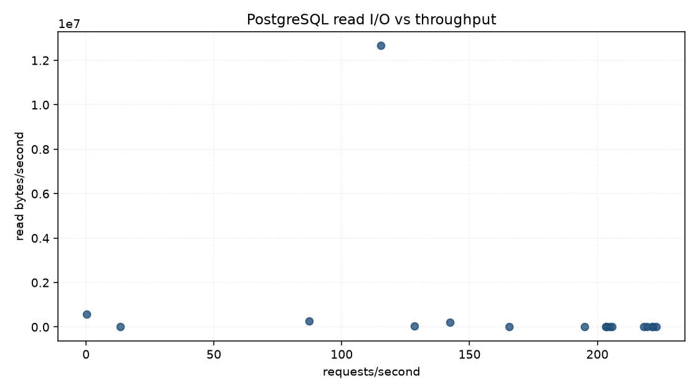

### Throughput by query class

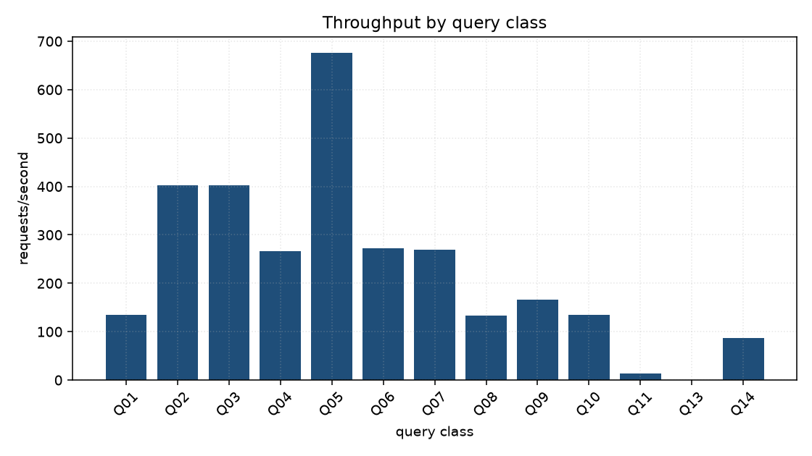

### Latency by query class

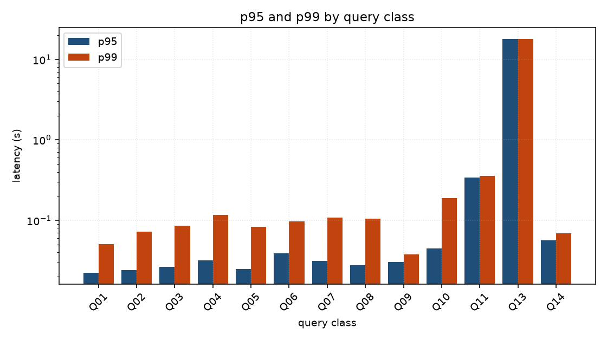

### Latency against response size

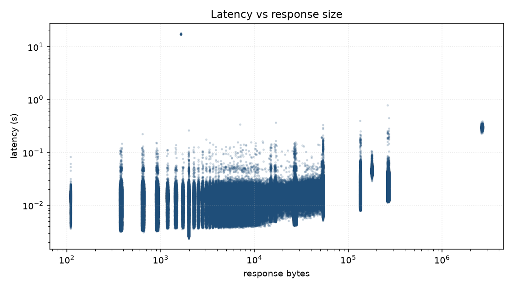

### Run-to-run variability

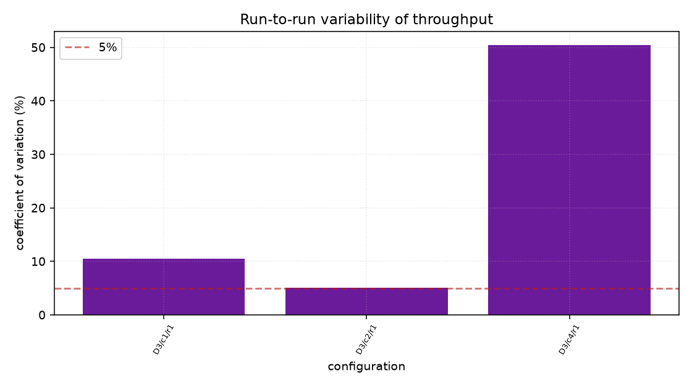

## Environment

| property | value |
| --- | --- |
| host | macOS-26.6.2-arm64-arm-64bit-Mach-O (14 CPUs) |
| Kubernetes | v1.36.1 |
| node capacity | 14 CPU, 16354760Ki |
| KEDA | ghcr.io/kedacore/keda:2.18.1 |
| PostgreSQL | PostgreSQL 18.6 (Debian 18.6-1.pgdg13+2) on aarch64-unknown-linux-gnu, compiled by gcc (Debian 14.2.0-19) 14.2.0, 64-bit |
| extensions | pg_sphere 1.5.2, pg_stat_statements 1.12, plpgsql 1.0 |
| seed | 20260823 |
| corpus sha256 | `c02caf7c44edae77` |
| chart values sha256 | `b6e9c1b32e19c965` |

[Download the per-measurement CSV](summary.csv) ·
[environment.json](environment.json) · [dataset.json](dataset.json)

Raw per-request samples and Prometheus series stay with the run that
produced them, under `benchmarks/tap-performance/results/20260823T231057Z-f0cd5bd7-db-scaling/`:
Parquet for every request and every metric, PostgreSQL statistics
before and after, `EXPLAIN` plans, and the exact ScaledObject and HPA
YAML the measurement ran against.
