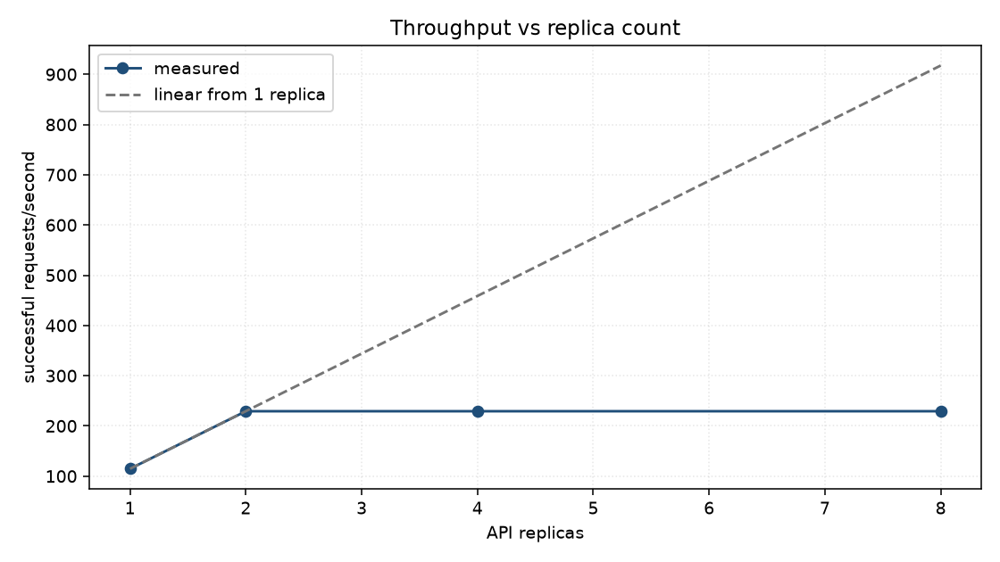
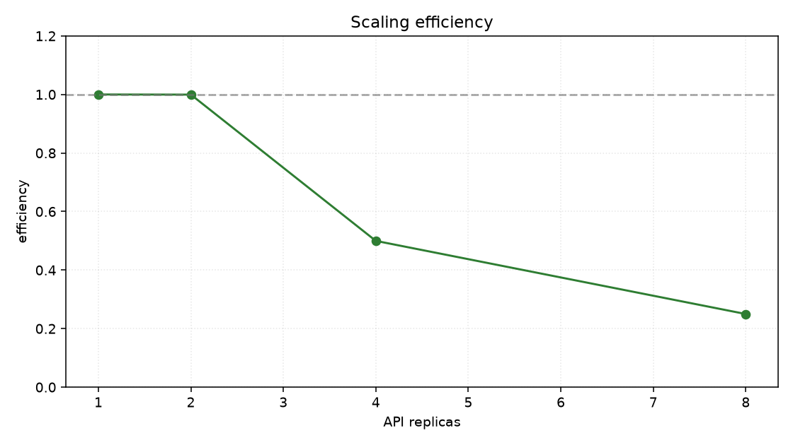
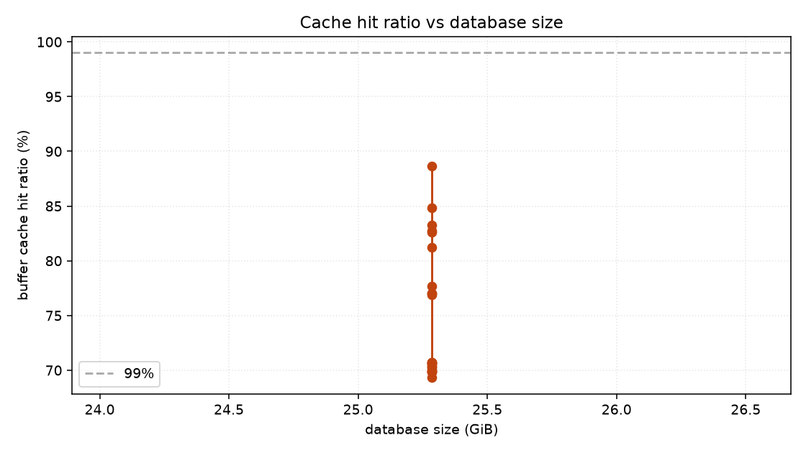
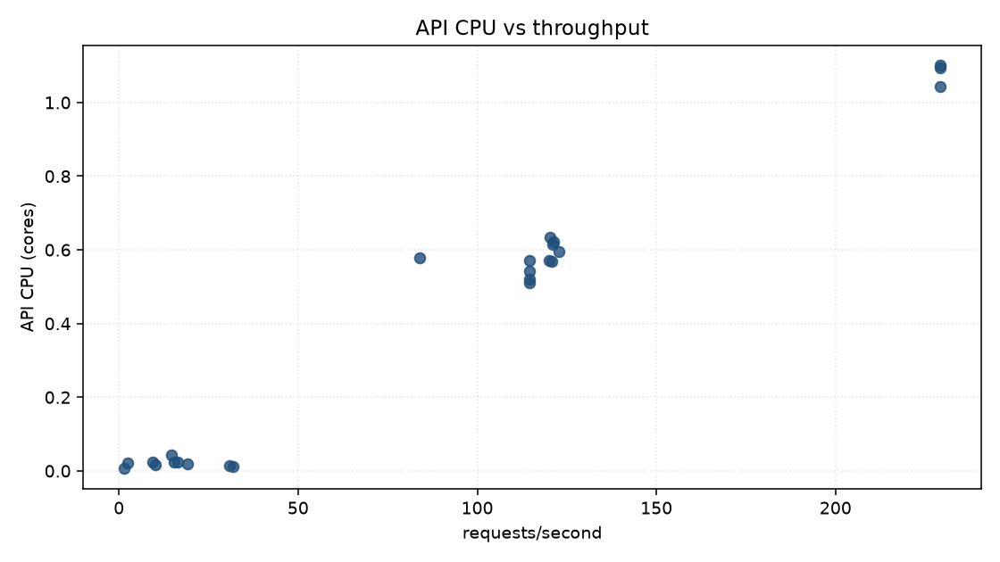
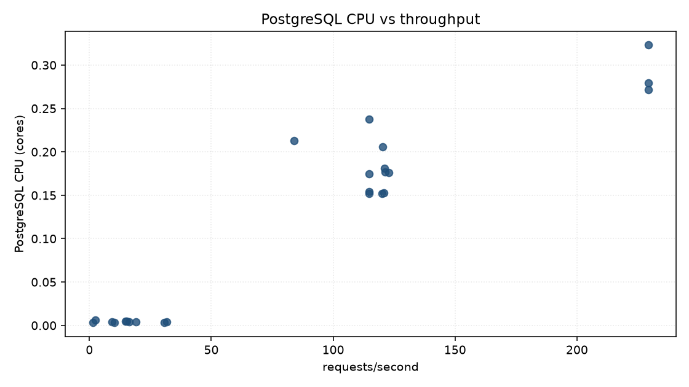
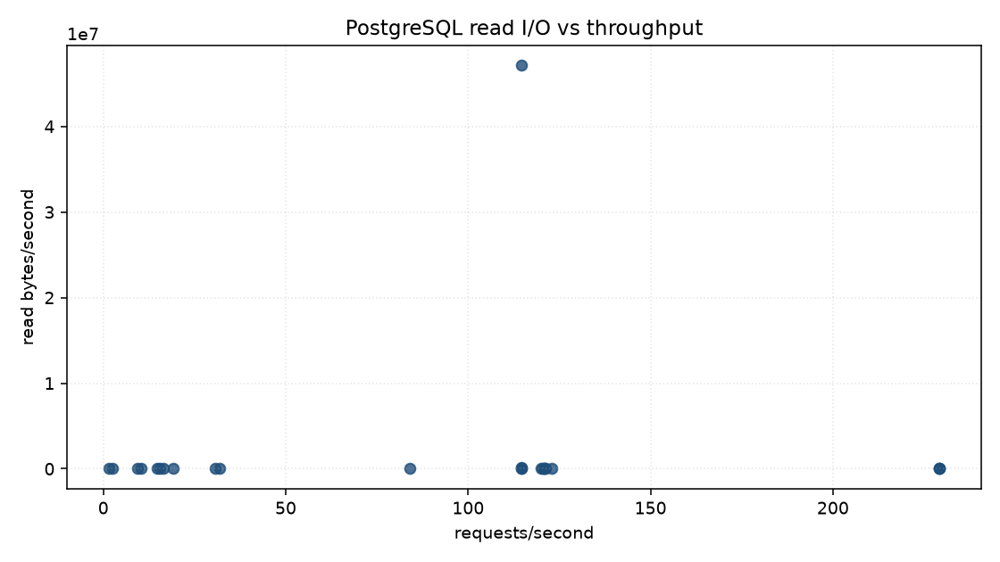
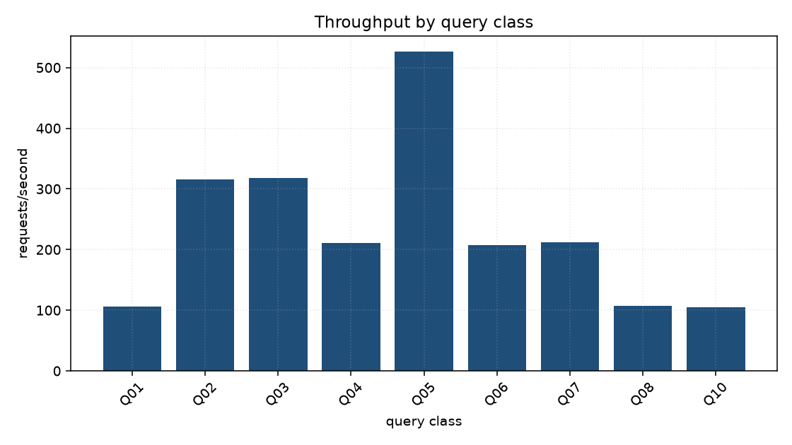
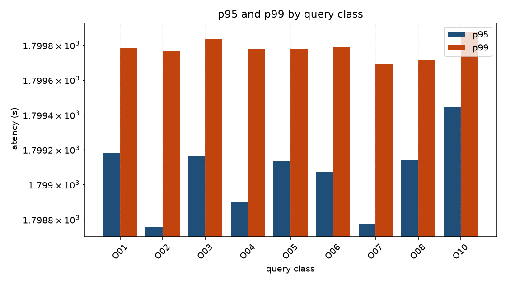
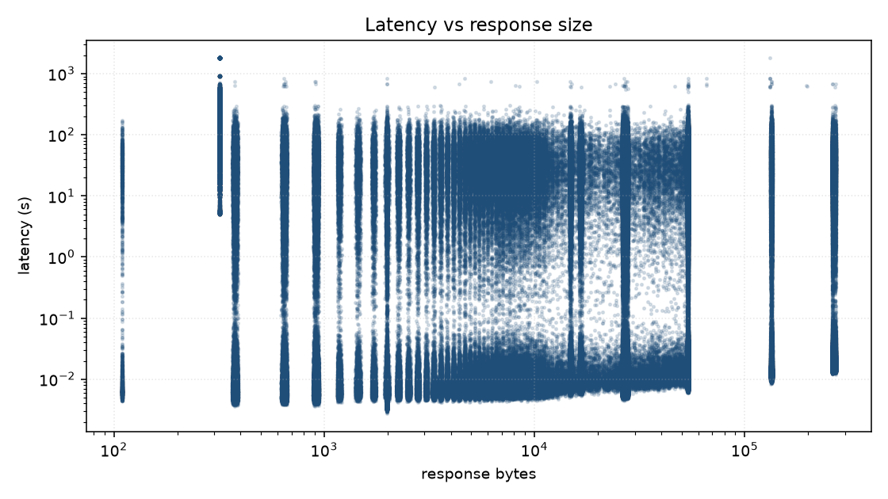
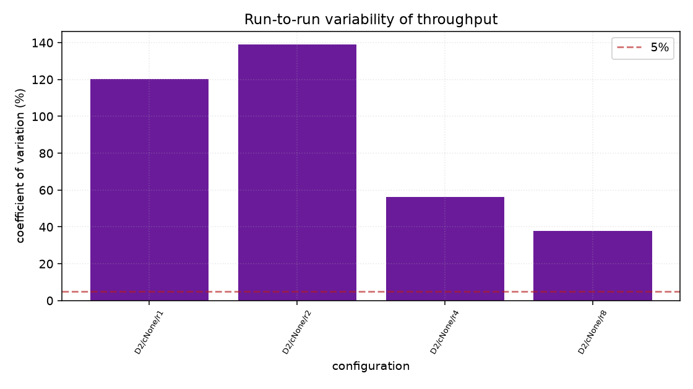

# Fixed Scaling — 20260824T014320Z

Run `20260824T014320Z-a5058118-fixed-scaling` · commit `b4fa9d642706` · 2026-08-24 06:22 UTC

!!! danger "This run is marked invalid"
    repl-D2-n2-x8.0: prometheus_coverage

    The numbers below are kept as evidence of what went wrong. They do
    not describe the service under the conditions intended.

## Headline

| finding | value | evidence |
| --- | --- | --- |
| replica scaling efficiency at 8 | **—** | not determined: one replica served every one of the 115 rps offered (repl-D2-n1-x0.5); 8 replicas served every one of the 231 rps offered (repl-D2-n8-x1.0). An efficiency needs a ceiling at each replica count, and no valid higher rung failed — every rung above is either unmeasured or was marked invalid. |
| sustainable single-replica capacity (C1) | **114.7** | highest successful rps over valid measurements with p95 within the 2.0s SLO and errors under 1% — a lower bound, since no valid higher rate failed |

## What was measured

| dataset | size | ObsCore rows | total rows | index/table | generation |
| --- | --- | --- | --- | --- | --- |
| D2 | 25.28 GiB | 7,399,024 | 106,348,439 | 0.63 | 12 s |

Sizes are `pg_database_size()` with indexes — not row counts times an
assumed row width. One database is grown through every target, so each
tier is a genuine prefix of the next.

## Throughput and latency against concurrency

_No measurements in this family._

Intervals are 95% Student-t across repetitions. The sweep stops when two
saturation signals agree, so the last row of a dataset is where that
dataset's ceiling was found rather than where the ladder ran out.

## Scaling out

| replicas | successful rps | offered rps | p95 (ms) | ceiling | efficiency | bottleneck |
| --- | --- | --- | --- | --- | --- | --- |
| 1 | 114.7 | 115.3 | 52 | not reached | — | `DATABASE_IO_BOUND` |
| 2 | 229.3 | 230.7 | 33 | not reached | — | `DATABASE_IO_BOUND` |
| 4 | 229.2 | 230.7 | 17 | not reached | — | `DATABASE_IO_BOUND` |
| 8 | 229.3 | 230.7 | 16 | not reached | — | `DATABASE_IO_BOUND` |

Each row is the highest rate that replica count served inside the
SLO. **ceiling** is whether the ladder went past it: `reached` means
a valid higher rate failed, so the rps beside it is a limit.
Efficiency is `throughput(N) / (N x throughput(1))` and is filled in
only where both that row and the single-replica row reached a
ceiling — otherwise the ratio would describe the rates offered, not
the ones the service could not exceed. Where it is filled in, the
shortfall is what the replicas contend over: one PostgreSQL.

## Where the limit was

| classification | measurements | meaning |
| --- | --- | --- |
| `DATABASE_IO_BOUND` | 24 | The working set does not fit in shared_buffers plus page cache: the database is fetching from disk. This is the class that appears as the dataset grows and is the reason the size sweep exists. |
| `CONNECTION_POOL_BOUND` | 14 | Requests are queueing for a database connection rather than for the database. Raising config.dbPoolMax helps only while the server has connections to give — otherwise this is the polite face of DATABASE_CPU_BOUND. |

## Graphs

### Throughput against replica count

### Scaling efficiency

### Buffer cache hit ratio against database size

### API CPU against throughput

### PostgreSQL CPU against throughput

### PostgreSQL read I/O against throughput

### Throughput by query class

### Latency by query class

### Latency against response size

### Run-to-run variability

## Environment

| property | value |
| --- | --- |
| host | macOS-26.6.2-arm64-arm-64bit-Mach-O (14 CPUs) |
| Kubernetes | v1.36.1 |
| node capacity | 14 CPU, 16354760Ki |
| KEDA | ghcr.io/kedacore/keda:2.18.1 |
| PostgreSQL | PostgreSQL 18.6 (Debian 18.6-1.pgdg13+2) on aarch64-unknown-linux-gnu, compiled by gcc (Debian 14.2.0-19) 14.2.0, 64-bit |
| extensions | pg_sphere 1.5.2, pg_stat_statements 1.12, plpgsql 1.0 |
| seed | 20260823 |
| corpus sha256 | `c02caf7c44edae77` |
| chart values sha256 | `b6e9c1b32e19c965` |

[Download the per-measurement CSV](summary.csv) ·
[environment.json](environment.json) · [dataset.json](dataset.json)

Raw per-request samples and Prometheus series stay with the run that
produced them, under `benchmarks/tap-performance/results/20260824T014320Z-a5058118-fixed-scaling/`:
Parquet for every request and every metric, PostgreSQL statistics
before and after, `EXPLAIN` plans, and the exact ScaledObject and HPA
YAML the measurement ran against.
