# Profile — 20260825T163627Z

Run `20260825T163627Z-034d69ba-profile` · commit `034d69bac95a` (working tree dirty) · 2026-08-25 17:52 UTC

!!! success "Validity guards passed"
    No swapping, no OOM kills, no unexpected restarts, disk headroom
    kept, load generator below its own ceiling, monitoring coverage
    complete.

## Headline

| finding | value | evidence |
| --- | --- | --- |
| peak single-replica throughput | **100.6** | conc-D1-c4-r0 at 4 clients, p95 61 ms |
| sustainable single-replica capacity (C1) | **100.6** | highest successful rps over valid measurements with p95 within the 2.0s SLO and errors under 1% |

## What was measured

| dataset | size | ObsCore rows | total rows | index/table | generation |
| --- | --- | --- | --- | --- | --- |
| D1 | 2.06 GiB | 600,120 | 8,624,396 | 0.63 | 4 s |

Sizes are `pg_database_size()` with indexes — not row counts times an
assumed row width. One database is grown through every target, so each
tier is a genuine prefix of the next.

## Throughput and latency against concurrency

| dataset | clients | reps | requests/s | p95 (ms) | errors | bottleneck |
| --- | --- | --- | --- | --- | --- | --- |
| D1 | 1 | 1 | 84.8 | 19 | 0.00% | `UNKNOWN` |
| D1 | 2 | 1 | 92.9 | 34 | 0.00% | `TAP_CPU_BOUND` |
| D1 | 4 | 1 | 100.6 | 61 | 0.00% | `TAP_CPU_BOUND` |
| D1 | 8 | 1 | 93.8 | 133 | 0.00% | `TAP_CPU_BOUND` |

Intervals are 95% Student-t across repetitions. The sweep stops when two
saturation signals agree, so the last row of a dataset is where that
dataset's ceiling was found rather than where the ladder ran out.

## Per-request CPU

One `tap-api` worker at `replicas: 1`, `workers: 1`, 4 concurrent clients. `cpu ms/request` is the
pod's own CPU accounting over the window divided by the requests it
served, so it is a measured total and not a profiler's estimate.

| rung | token | requests/s | p95 (ms) | API CPU (cores) | cpu ms/request | errors |
| --- | --- | --- | --- | --- | --- | --- |
| `all` | no | 97.0 | 64 | 0.996 | 10.27 | 0.00% |
| `authgated` | yes | 92.0 | 67 | 1.054 | 11.46 | 0.00% |
| `authgil` | yes | 93.2 | 66 | 1.007 | 10.81 | 0.00% |
| `authverify` | yes | 95.1 | 65 | 1.045 | 11.00 | 0.00% |
| `base` | no | 96.2 | 65 | 1.015 | 10.55 | 0.00% |
| `gil` | no | 95.3 | 65 | 0.993 | 10.42 | 0.00% |
| `noauth` | no | 100.0 | 62 | 1.047 | 10.48 | 0.00% |

### Where it goes

24,593 GIL-held stacks sampled at 100 Hz while the
worker was saturated. A sample is attributed to the innermost frame that
names a subsystem, so stdlib time rolls up to the part of the request
that spent it. 99.1% of samples reach a
named subsystem and 75.3% of the
total is the application's own work rather than the server, the router
or the event loop.

| subsystem | ms/request | share |
| --- | --- | --- |
| adql translation | 3.19 | 30.9% |
| result writers | 2.29 | 22.1% |
| psycopg and row conversion | 1.61 | 15.6% |
| event loop | 0.95 | 9.2% |
| threadpool handoff | 0.81 | 7.8% |
| asgi routing and dependencies | 0.58 | 5.6% |
| query preparation | 0.32 | 3.1% |
| observability | 0.23 | 2.2% |
| http server | 0.14 | 1.4% |
| egernia (other) | 0.11 | 1.1% |
| parameter parsing and validation | 0.09 | 0.9% |
| token verification | 0.00 | 0.0% |

### What a verified bearer token costs

Against 98.1 rps and
10.51 ms/request unauthenticated — the mean
of the two unauthenticated rungs either side, because the authenticated
ones are separated from them by a chart upgrade and a pod restart.

| rung | requests/s | throughput cost | cpu ms/request | added ms/request |
| --- | --- | --- | --- | --- |
| `authverify` | 95.1 | 3.1% | 11.00 | 0.48 |
| `authgated` | 92.0 | 6.2% | 11.46 | 0.94 |

`authverify` verifies every token and enforces nothing; `authgated`
additionally takes an authorisation decision on the whole query surface.
Tokens are RS256, 2,048-bit, from an in-cluster issuer whose JWKS the
service caches for its configured five minutes — so this is the cost of
verifying a signature per request, not of reaching an IAM per request.

## Where the limit was

| classification | measurements | meaning |
| --- | --- | --- |
| `TAP_CPU_BOUND` | 14 | The API's own CPU is the constraint: it sat at its ceiling, or was CFS-throttled, for a material part of the window. The ceiling compared against is min(pod CPU limit, workers), not the pod limit: ADQL translation is pure-Python and holds the GIL, so one worker cannot exceed one core whatever the cgroup allows. Relieved by more processes (tapApi.workers) or more pods, never by a bigger limit on one worker. |
| `UNKNOWN` | 1 | Nothing saturated by these rules. Either the offered load was below every ceiling, or the limit is somewhere this suite does not instrument — which is itself worth knowing. |

## Graphs

### Throughput against offered concurrency

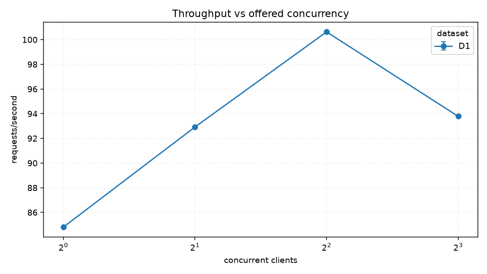

### Latency percentiles against concurrency

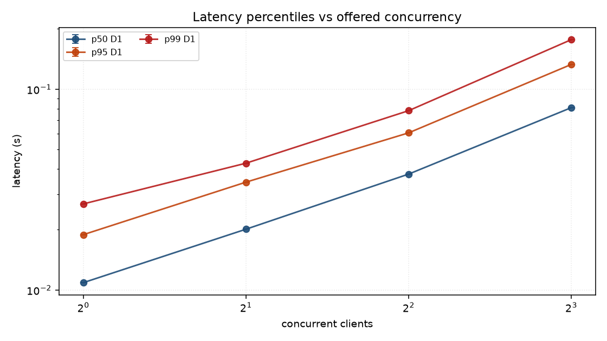

### Errors against concurrency

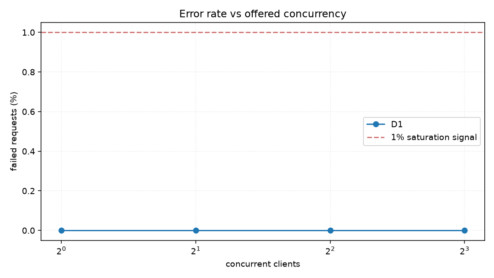

### Buffer cache hit ratio against database size

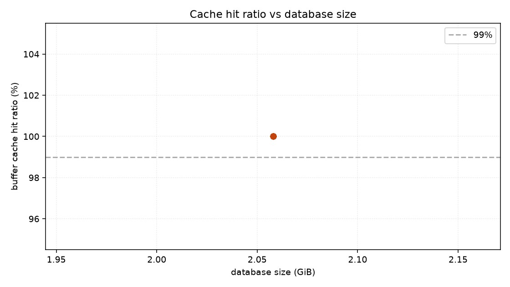

### API CPU against throughput

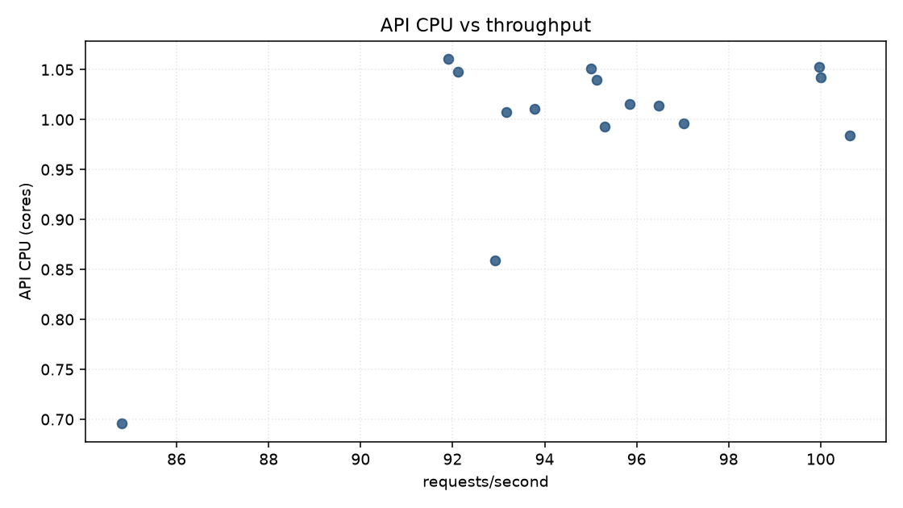

### PostgreSQL CPU against throughput

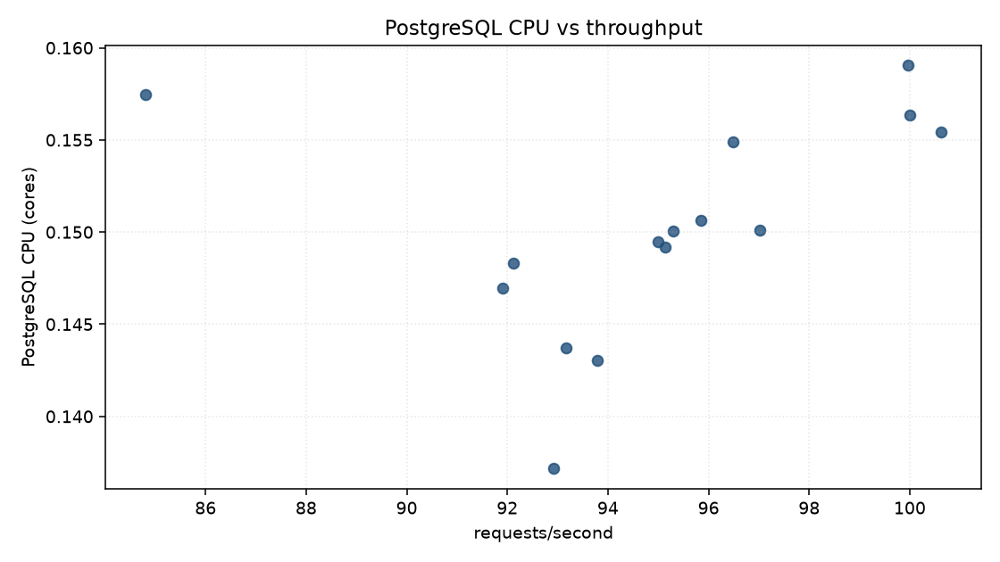

### PostgreSQL read I/O against throughput

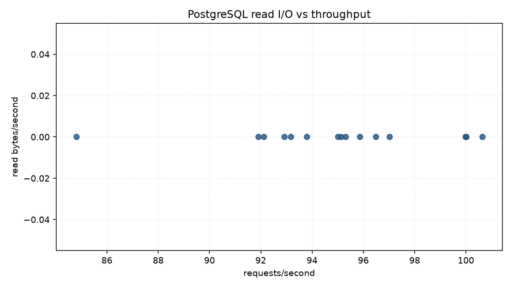

### Throughput by query class

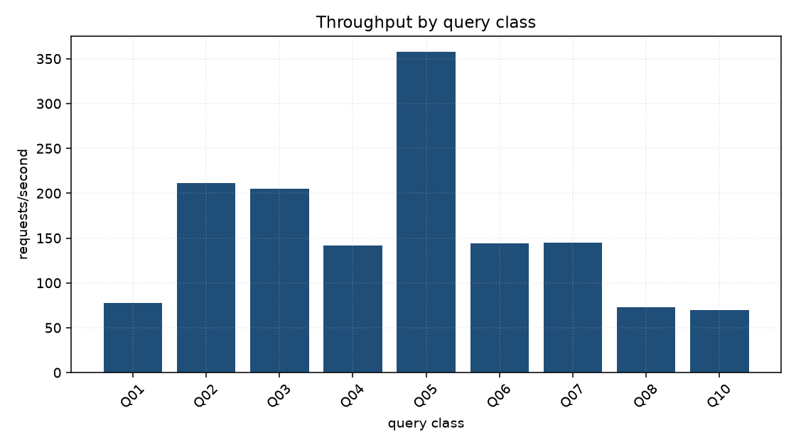

### Latency by query class

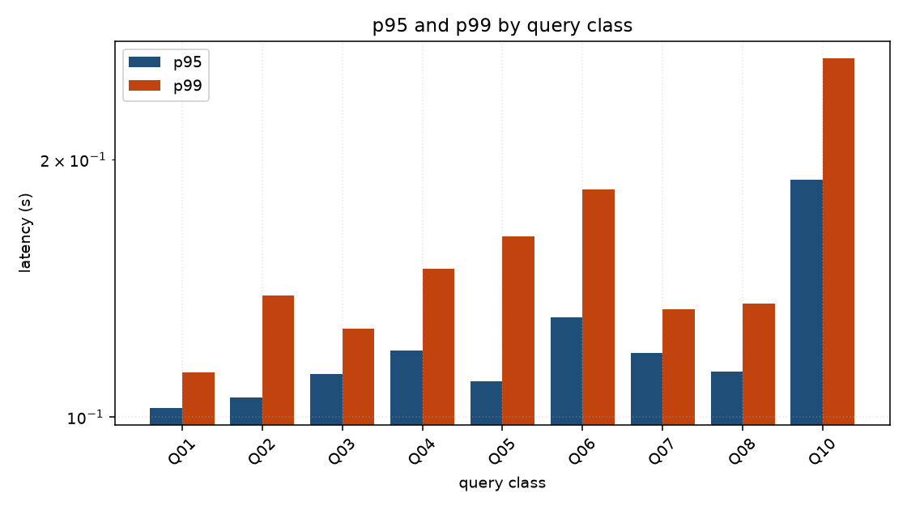

### Latency against response size

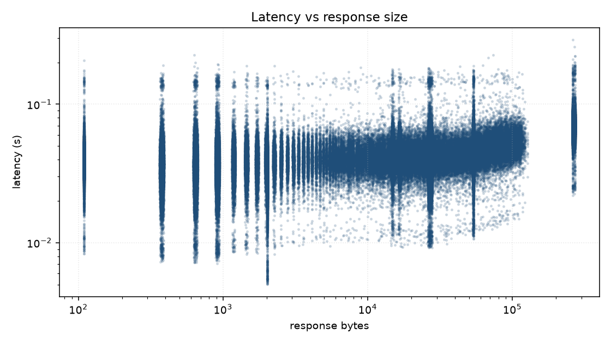

### Run-to-run variability

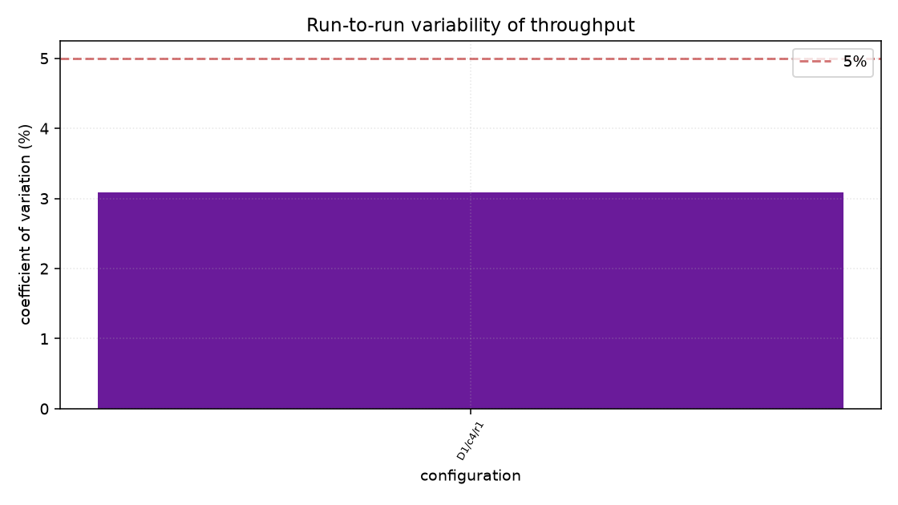

## Environment

| property | value |
| --- | --- |
| host | Linux-6.8.0-134-generic-x86_64-with-glibc2.39 (30 CPUs) |
| Kubernetes | v1.33.1 |
| node capacity | 30 CPU, 126738624Ki |
| KEDA | ghcr.io/kedacore/keda:2.18.1 |
| PostgreSQL | PostgreSQL 18.6 (Debian 18.6-1.pgdg13+2) on x86_64-pc-linux-gnu, compiled by gcc (Debian 14.2.0-19) 14.2.0, 64-bit |
| extensions | pg_sphere 1.5.2, pg_stat_statements 1.12, plpgsql 1.0 |
| seed | 20260823 |
| corpus sha256 | `790d4fe759798bdb` |
| chart values sha256 | `b4c352f2cc249ec0` |

[Download the per-measurement CSV](summary.csv) ·
[environment.json](environment.json) · [dataset.json](dataset.json)

Raw per-request samples and Prometheus series stay with the run that
produced them, under `benchmarks/egernia-performance/results/20260825T163627Z-034d69ba-profile/`:
Parquet for every request and every metric, PostgreSQL statistics
before and after, `EXPLAIN` plans, and the exact ScaledObject and HPA
YAML the measurement ran against.
