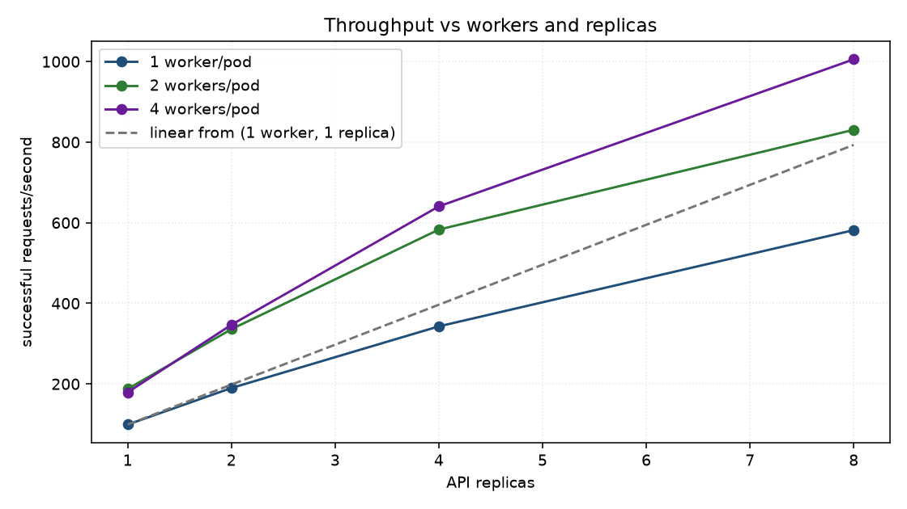
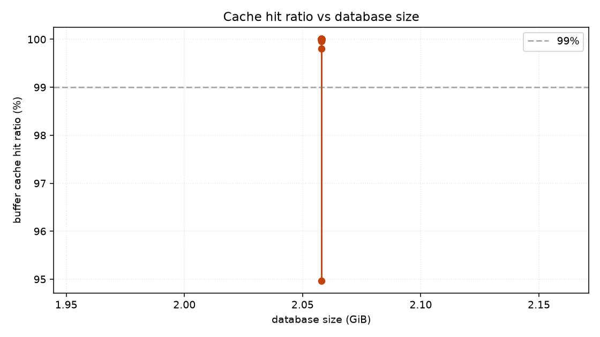
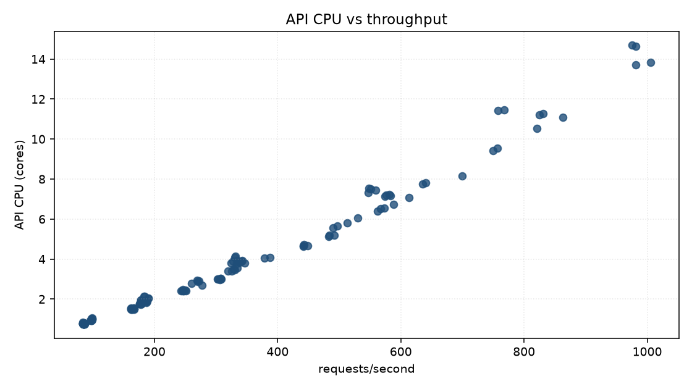
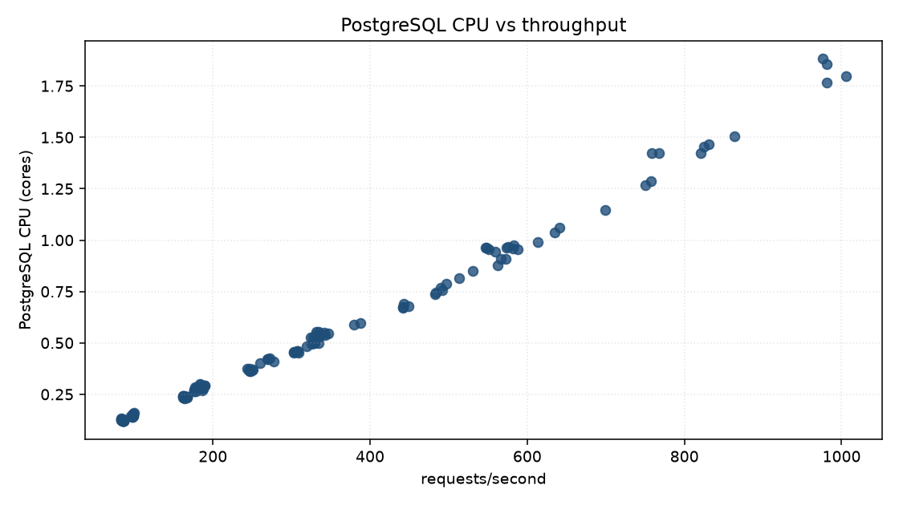
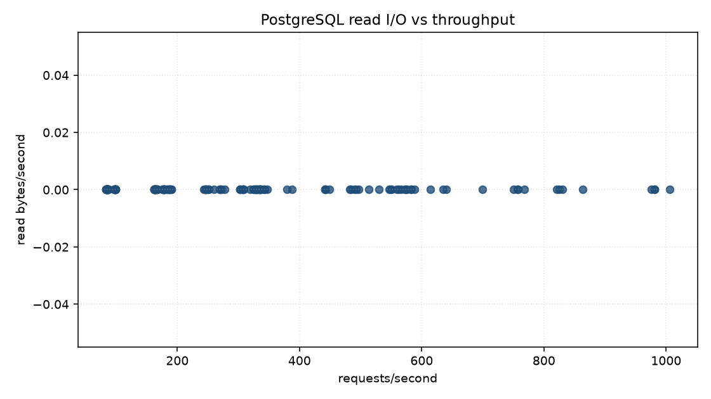
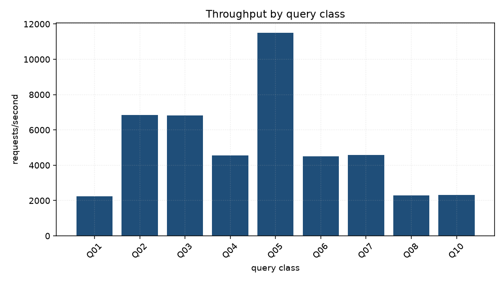
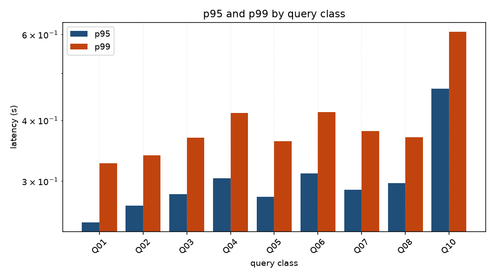
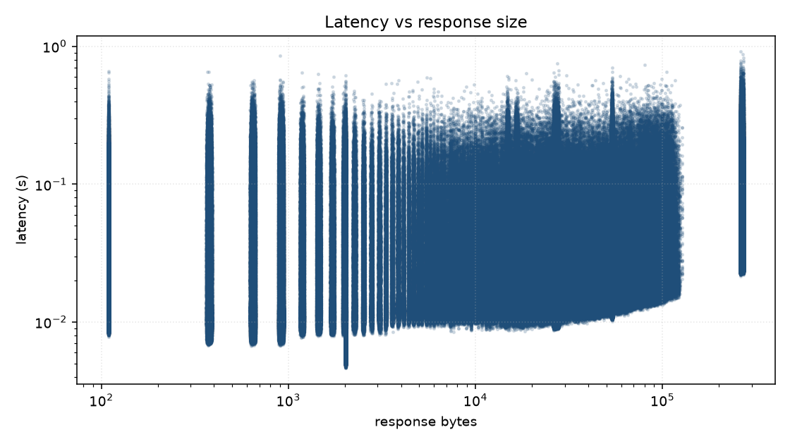
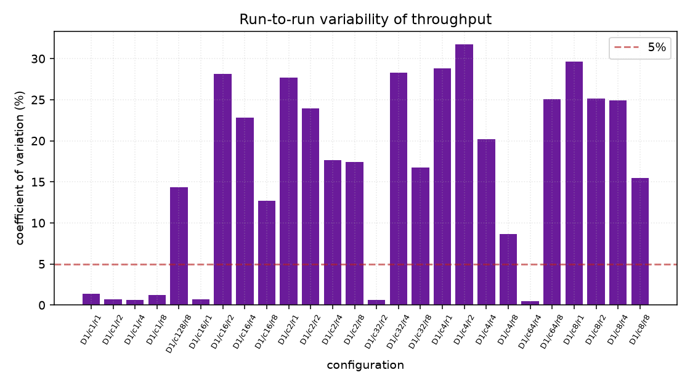

# Worker Sweep — 20260825T180219Z

Run `20260825T180219Z-f8b21fc4-worker-sweep` · commit `68f47d7fcac6` · 2026-08-25 21:59 UTC

!!! danger "One rung of this run is marked invalid"
    wsweep-w4-n1-D1-c1-r0: prometheus_coverage

    The invalidity is per-rung: this one measurement is excluded from the
    capacity tables below (and from C1), which are computed over the valid
    rungs only. It is kept on the page as evidence of what went wrong.

## Headline

| finding | value | evidence |
| --- | --- | --- |
| sustainable single-replica capacity (C1) | **99.1** | highest successful rps at the deployed shape (values-file workers and CPU limit), single replica, p95 within the 2.0s SLO and errors under 1% |

## What was measured

| dataset | size | ObsCore rows | total rows | index/table | generation |
| --- | --- | --- | --- | --- | --- |
| D1 | 2.06 GiB | 600,120 | 8,624,396 | 0.63 | 4 s |

Sizes are `pg_database_size()` with indexes — not row counts times an
assumed row width. One database is grown through every target, so each
tier is a genuine prefix of the next.

## Throughput and latency against concurrency

_No measurements in this family._

Intervals are 95% Student-t across repetitions. The sweep stops when two
saturation signals agree, so the last row of a dataset is where that
dataset's ceiling was found rather than where the ladder ran out.

## Workers against replicas

| workers | replicas | processes | successful rps | rps/process | p95 (ms) | ceiling | pool ceiling (connections) | bottleneck |
| --- | --- | --- | --- | --- | --- | --- | --- | --- |
| 1 | 1 | 1 | 99.1 | 99.1 | 61 | reached | 8 | `TAP_CPU_BOUND` |
| 1 | 2 | 2 | 189.9 | 94.9 | 71 | reached | 16 | `TAP_CPU_BOUND` |
| 1 | 4 | 4 | 342.9 | 85.7 | 84 | reached | 32 | `TAP_CPU_BOUND` |
| 1 | 8 | 8 | 581.6 | 72.7 | 98 | reached | 64 | `TAP_CPU_BOUND` |
| 2 | 1 | 2 | 187.6 | 93.8 | 34 | reached | 16 | `TAP_CPU_BOUND` |
| 2 | 2 | 4 | 335.8 | 84.0 | 73 | reached | 32 | `TAP_CPU_BOUND` |
| 2 | 4 | 8 | 583.0 | 72.9 | 105 | reached | 64 | `TAP_CPU_BOUND` |
| 2 | 8 | 16 | 830.7 | 51.9 | 145 | reached | 128 | `UNKNOWN` |
| 4 | 1 | 4 | 179.2 | 44.8 | 87 | reached | 32 | `TAP_CPU_BOUND` |
| 4 | 2 | 8 | 346.7 | 43.3 | 94 | reached | 64 | `TAP_CPU_BOUND` |
| 4 | 4 | 16 | 640.6 | 40.0 | 116 | reached | 128 | `TAP_CPU_BOUND` |
| 4 | 8 | 32 | 1,005.5 | 31.4 | 134 | reached | 256 ⚠ exceeds max_connections | `TAP_CPU_BOUND` |

The same closed-loop ladder at every (workers, replicas) point —
same host, same corpus, same seeds — so two rows differ in the
fleet's shape and nothing else. A worker costs no pod but holds its
own connection pool: the **pool ceiling** column is
`replicas x workers x dbPoolMax`, which is what the shape can open
against the database's `max_connections`.

## Where the limit was

| classification | measurements | meaning |
| --- | --- | --- |
| `UNKNOWN` | 88 | Nothing saturated by these rules. Either the offered load was below every ceiling, or the limit is somewhere this suite does not instrument — which is itself worth knowing. |
| `TAP_CPU_BOUND` | 50 | The API's own CPU is the constraint: it sat at its ceiling, or was CFS-throttled, for a material part of the window. The ceiling compared against is min(pod CPU limit, workers), not the pod limit: ADQL translation is pure-Python and holds the GIL, so one worker cannot exceed one core whatever the cgroup allows. Relieved by more processes (tapApi.workers) or more pods, never by a bigger limit on one worker. |
| `MEMORY_BOUND` | 9 | A container approached or exceeded its memory limit. An OOM kill invalidates the run outright; sustained pressure below it still distorts latency through reclaim. |
| `DATABASE_IO_BOUND` | 1 | The working set does not fit in shared_buffers plus page cache: the database is fetching from disk. This is the class that appears as the dataset grows and is the reason the size sweep exists. |

## Graphs

### Throughput against workers and replicas

### Buffer cache hit ratio against database size

### API CPU against throughput

### PostgreSQL CPU against throughput

### PostgreSQL read I/O against throughput

### Throughput by query class

### Latency by query class

### Latency against response size

### Run-to-run variability

## Environment

| property | value |
| --- | --- |
| host | Linux-6.8.0-134-generic-x86_64-with-glibc2.39 (30 CPUs) |
| Kubernetes | v1.33.1 |
| node capacity | 30 CPU, 126738624Ki |
| KEDA | ghcr.io/kedacore/keda:2.18.1 |
| PostgreSQL | PostgreSQL 18.6 (Debian 18.6-1.pgdg13+2) on x86_64-pc-linux-gnu, compiled by gcc (Debian 14.2.0-19) 14.2.0, 64-bit |
| extensions | pg_sphere 1.5.2, pg_stat_statements 1.12, plpgsql 1.0 |
| seed | 20260823 |
| corpus sha256 | `790d4fe759798bdb` |
| chart values sha256 | `b4c352f2cc249ec0` |

[Download the per-measurement CSV](summary.csv) ·
[environment.json](environment.json) · [dataset.json](dataset.json)

Raw per-request samples and Prometheus series stay with the run that
produced them, under `benchmarks/egernia-performance/results/20260825T180219Z-f8b21fc4-worker-sweep/`:
Parquet for every request and every metric, PostgreSQL statistics
before and after, `EXPLAIN` plans, and the exact ScaledObject and HPA
YAML the measurement ran against.
